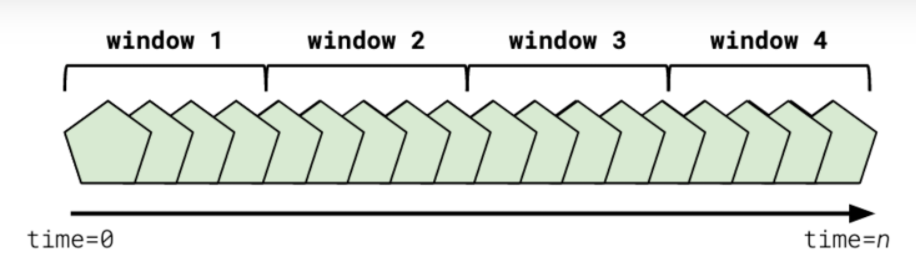

_Notes on Kafka Lesson 5 | August 2020_ 

# Stream Processing Fundamentals

# Glossary

- **Join (Streams)** - The process of combining one or more streams into an output stream, typically on some related key attribute.
- **Filtering (Streams)** - The process of removing certain events in a data stream based on a condition
- **Aggregating (Streams)** - The process of summing, reducing, or otherwise grouping data based on a key attribute
- **Remapping (Streams)** - The process of modifying the input stream data structure into a different output structure. This may include the addition or removal of fields on a given event.
- **Windowing (Streams)** - Defining a period of time from which data is analyzed. Once data falls outside of that period of time, it is no longer valid for streaming analysis.
- **Tumbling Window (Streams)** - The tumbling window defines a block of time which rolls over once the duration has elapsed. A tumbling window of one hour, started now, would collect all data for the next 60 minutes. Then, at the 60 minute mark, it would reset all of the data in the topic, and begin collecting a fresh set of data for the next 60 minutes.
- **Hopping Window (Streams)** - Hopping windows advance in defined increments of time. A hopping window consists of a window length, e.g. 30 minutes, and an increment time, e.g. 5 minutes. Every time the increment time expires, the window is advanced forward by the increment.
- **Sliding Window (Streams)** - Sliding Windows work identically to Hopping Windows, except the increment period is much smaller -- typically measured in seconds. Sliding windows are constantly updated and always represent the most up-to-date state of a given stream aggregation.
- **Stream** - Streams contain all events in a topic, immutable, and in order. As new events occur, they are simply appended to the end of the stream.
- **Table** - Tables are the result of aggregation operations in stream processing applications. They are a roll-up, point-in-time view of data.
- **Stateful** - Stateful operations must store the intermediate results of combining multiple events to represent the latest point-in-time value for a given key

---

## Stream Processing Basics

Stream processing never stops running.

The core stream processing tasks are:
- combining
- filtering
- aggregating
- reducing

### Combining or Joining Streams

Combining two or more streams and creating a single output stream. 

Joined streams share some common attribute across the data in all of the streams. We might use `user_id` to merge user streams.

Usually windowing is used to reset the state once a time window is reached. 

### Filtering Streams

Filtering removes unwanted data from an inputs stream and output desired data into a new stream.

Desirable when data clients don't access to all data for throughput or security reasons.

Apply filter earlier rather than later, to scale better and analyze less data.  

### Remapping Streams

Remapping transforms an input event and outputs it in a different form to a new stream.

An example is changing output to a different format, removing a field in the data, renaming field, or moving data fields.

One example is removing personally identifiable information (e.g. email, phone, address). 

### Aggregating Streams

Aggregationg involves taking two or more distinct events and creating one or more new events based on an aggregation function.

Aggregation function: Max, min, sum, topN, Histograms, sets, lists, and more.

Aggregates in streaming almost always involve a timeframe. 

If the topic is compacted, the data would be the latest. If the topic is expired, the data is not the latest, we need to define a time window.

## Handling Time

In stream processing, we don't look at all the data at once. We look at a start and end time (**windowing**)

Windows can also be set to the past. E.g. One hour yesterday from 7-8 pm. 

Windows are the building block of stream processing. 

### Tumbling Window

Tumbling window is a fixed period of time that rolls over after the fixed window has ended. 

When the new time window is reached, data is cleared and starts over again. 

Tumbling windows do not overlap

Tumbling windows do not have gaps between windowed periods

Example: Measure the link that was clicked the most in the past 10 minutes.

### Hopping Window

Hopping window have a fixed increment which advances the window. 

Hopping windows have both a duration and an increment by which they are advanced.

Hopping windows can overlap with previous windows.

Hopping windows can have gaps if the increment time is greater than the duration period.

Example: Measure the last 10 minutes of click events on a 1-minute rolling basis

### Sliding Window

Sliding windows are hopping windows that increment in real time.

Similar to hopping window, except the increment is very short and updates in real time. 

Sliding window always have the latest data. 

Sliding windows have no gaps between windows.

Sliding windows overlap with previous windows.

## Streams versus Table

Table implies state (represent condition at a point in time) and shows aggregated/roll-up views. Tables are result of aggregation operations in stream processing applications.

Streams is an never-ending, immutable, ordered series of events.

Streams are commonly used to **enrich** data with new fields. 

Streams and Tables are **complementary tools**.
- they describe processing output
- streams output an unbounded sequence of events
- tables output an aggregated view of the data

### Data storage

Table operations are stateful, meaning we must **store the results of combining multiple events** to represent the point-in-time value for data.

Table operations require some form of storage.
- in-memory storage
- dedicated databases RocksDB

Stream processing frameworks require a changelog 
- Changelog topics are log compaceted
- changelog ensures fault tolerance and helps in recovery

RocksDB was a **highly optimized local state store** built by Facebook. Always use RocksDB in production. In memory storage is not appropriate for production (may be ok for personal projects). 

RocksDB dramatically speeds reboot/recovery times. Used by all streaming frameworks.

### Resources

- [Streams and Tables article](https://www.michael-noll.com/blog/2018/04/05/of-stream-and-tables-in-kafka-and-stream-processing-part1/)
- [RocksDB](https://rocksdb.org/)
- [Kafka Streams state](https://docs.confluent.io/current/streams/architecture.html#state)