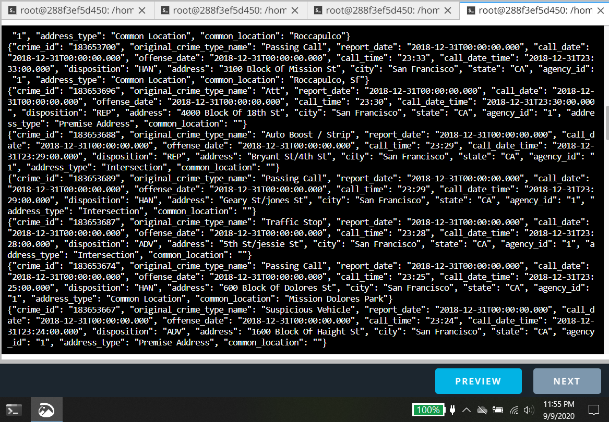
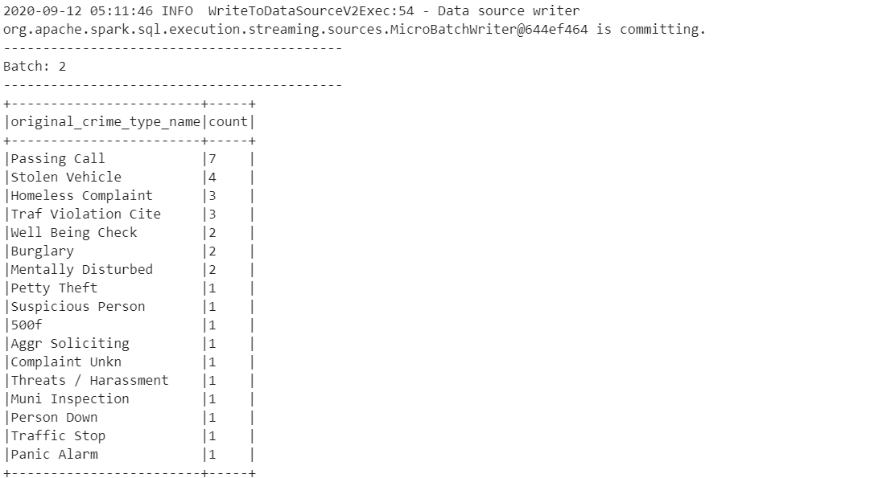

_This is project 2 of Udacity's Data Streaming Nanodegree program | Completed in September 2020_

# Data Streaming Project - Spark Structured Streaming

The goal is to build a simple Apache Kafka - Spark streaming pipeline.

Data from Kaggle on San Francisco crime incidents is used to simulate producing data to a Kafka server. Data from Kafka is then ingested by Spark and an aggregation and stream-table join is performed. 

> Note that the project comes with starter code and files. The main tasks in the project were to fill in key components in the `config`, `kafka_server.py`, `producer_server.py`, and `data_stream.py` files.

Technology used in this project:
- Apache Kafka
- Spark Structured Streaming

## Running the files

1. Install requirements using `./start.sh`
2. Start Zookeeper and Kafka servers using:
```
/usr/bin/zookeeper-server-start config/zookeeper.properties
/usr/bin/kafka-server-start config/producer.properties
```
3. Run the `producer_server.py` and the `kafka_server.py` to initiate the server
4. Start the Spark Streaming data processing using: (output is saved in a .log file)
```
spark-submit --packages org.apache.spark:spark-sql-kafka-0-10_2.11:2.3.4 --master local[*] data_stream.py > submit.log
```

## Project Results

Here is a screenshot showing the output of Kafka consumer console to show that data was successfully produced in Kafka:

<p align="center"></p>

Here is the output of the aggregation in Spark:

<p align="center"></p>

Here is a screenshot of the process in Spark UI:

<p align="center"></p>

## Extra questions

1. How did changing values on the SparkSession property parameters affect the throughput and latency of the data?
- The speed of the processing can be improved by assigning more memory to both the driver and the executor of the cluster via the `spark.driver.memory` and `spark.executor.memory` config options. Additionally, I can increase the number of cores and parallelism of the process using the `spark.driver.cores`, `spark.executor.cores`, `spark.default.parallelism`. The outcome is a higher throughput though there is more network overhead involved when more distributed servers are involved. In this case keeping the number of cores to the default of 1 is sufficient. Furthermore, the `processingTime` parameter of the `trigger` function of `writeStream` can be reduced to increase throughput. The `maxRatePerPartition` option of `readStream` can also be tweaked to achieve the desired throughput. 

2. What were the 2-3 most efficient SparkSession property key/value pairs? Through testing multiple variations on values, how can you tell these were the most optimal?
- Based on testing, increasing the `spark.driver.memory` and `spark.executor.memory` to "2g" or 2 gigabytes improved processing speed. Keeping `spark.driver.cores` and `spark.executor.cores` to the default was optimal. Finally keeping the `maxRatePerPartition` option of readStream to roughly 200 was sufficient for the task. 