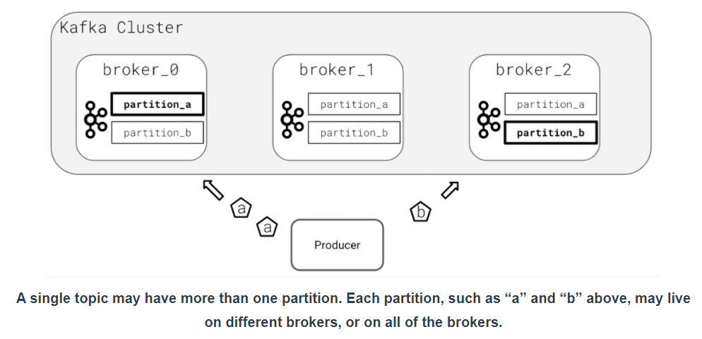

_Notes on Kafka Lesson 2 | August 2020_ 

# Glossary

- **Broker (Kafka)** - A single member server of the Kafka cluster
- **Cluster (Kafka)** - A group of one or more Kafka Brokers working together to satisfy Kafka production and consumption
- **Node** - A single computing instance. May be physical, as in a server in a datacenter, or virtual, as an instance might be in AWS, GCP, or Azure.
- **Zookeeper** - Used by Kafka Brokers to determine which broker is the leader of a given partition and topic, as well as track cluster membership and configuration for Kafka
- **Access Control List (ACL)** - Permissions associated with an object. In Kafka, this typically refers to a user’s permissions with respect to production and consumption, and/or the topics themselves.
- **JVM** - The Java Virtual Machine - Responsible for allowing host computers to execute the byte-code compiled against the JVM.
- **Data Partition (Kafka)** - Kafka topics consist of one or more partitions. A partition is a log which provides ordering guarantees for all of the data contained within it. Partitions are chosen by hashing key values.
- **Data Replication (Kafka)** - A mechanism by which data is written to more than one broker to ensure that if a single broker is lost, a replicated copy of the data is available.
- **In-Sync Replica (ISR)** - A broker which is up to date with the leader for a particular broker for all of the messages in the current topic. This number may be less than the replication factor for a topic.
- **Rebalance** - A process in which the current set of consumers changes (addition or removal of consumer). When this occurs, assignment of partitions to the various consumers in a consumer group must be changed.
- **Data Expiration** - A process in which data is removed from a Topic log, determined by data retention policies.
- **Data Retention** - Policies that determine how long data should be kept. Configured by time or size.
- **Batch Size** - The number of messages that are sent or received from Kafka
- `acks` - The number of broker acknowledgements that must be received from Kafka before a producer continues processing
- **Synchronous Production** - Producers which send a message and wait for a response before performing additional processing
- **Asynchronous Production** - Producers which send a message and do not wait for a response before performing additional processing
- **Avro** - A binary message serialization format
- **Message Serialization** - The process of transforming an application's internal data representation to a format suitable for interprocess communication over a protocol like TCP or HTTP.
- **Message Deserialization** - The process of transforming an incoming set of data from a form suitable for interprocess communication, into a data representation more suitable for the application receiving the data.
- **Retries (Kafka Producer)** - The number of times the underlying library will attempt to deliver data before moving on
- **Consumer Offset** - A value indicating the last seen and processed message of a given consumer, by ID.
- **Consumer Group** - A collection of one or more consumers, identified by group.id which collaborate to consume data from Kafka and share a consumer offset.
- **Consumer Group Coordinator** - The broker in charge of working with the Consumer Group Leader to initiate a rebalance
- **Consumer Group Leader** - The consumer in charge of working with the Group Coordinator to manage the consumer group
- **Topic Subscription** - Kafka consumers indicate to the Kafka Cluster that they would like to consume from one or more topics by specifying one or more topics that they wish to subscribe to
- **Consumer Lag** - The difference between the offset of a consumer group and the latest message offset in Kafka itself
- **CCPA** - California Consumer Privacy Act
- **GDPR** - General Data Protection Regulation

---

<p align="center"></p>

# Apache Kafka

Kafka is built on **JVM**.

Kafka servers are referred to as **brokers**. Clusters may consist of one or many brokers.

Brokers are **intermediaries between producer applications and consumer applications**.

Apache Zookeeper is used by Kafka to determine which broker is the leader of a given partition and topic. 

Zookeeper keeps track of which brokers are part of Kafka cluster. Zookeeper stores configuration for topics and permissions.

Zookeeper allows broker to enter and leave a cluster easily (grow easily as usage increases).


<p align="center"></p>


Kafka stores data in text files in broker disk.

<p align="center"></p>

### Kafka partitions

Kafka is partitioned to enable high throughput (parallel processing).

A partition contains an ordered subset of data in the topic.

Every partition has a single leader broker, elected by Zookeeper. Producers evenly hash data to partitions.

<p align="center"></p>

### Kafka replication

Data Replication helps prevent data loss by writing the same data to more than one broker.

When a leader broker for a partition is lost, a new leader is elected by Zookeeper. 

Number of replica can be configured (globally or for each topic).

Can't have more replicas than number of brokers.

### Checking data in Kafka

Data in Kafka is stored in the `var/lib/lab/kafka/data/` directory.

### Kafka Topics

A broker must be an In Sync Replica (ISR) to become leader.

Desired number of ISRs can be set on topics. Be careful not to set it too high (slow down processing). 

Ordering is guaranteed only within a topic's partitions.

Determine the number of partitions: 
> Number of Partitions = Max(Overall Throughput/Producer Throughput, Overall Throughput/Consumer Throughput)

Kafka naming convention: 
- alphanumeric characters (a-z, A-Z, 0-9, ".", "-")
- Example `com.udacity.lesson.quiz_complete`
- where `com.udacity` is the domain, `lesson` is the model, and `quiz_complete` is the event

Topics may expire based on time and size limit. Using `retention.bytes` and `retention.ms` settings. When data expires it is deleted (set using `cleanup.policy` set to `delete`)

Log compaction removes repeat messages in Kafka topic. (`cleanup.policy` set to `compact`)

Compression options are available using lz4, ztsd, snappy, gzip (using `compression.type` setting)

**Never put more than one event in a single topic**. Topic should store data for one type of event only.

### Creating Topics in Kafka

Always manually create topic (or use bash). Don't rely on automatic topic creation. 

## Kafka Producers

Synchronous producers (rare): send data to Kafka and block program until broker has confirmed receipt
- waiting for delivery of credit card transaction before moving forward
- not the default
- used where data loss cannot be tolerated

Asynchronous producers (common): send data and immediately continue
- maximize throughput to Kafka
- can offer callbacks when message is delivered or if error occurs
- can also fire and forget and don't check for broker receiving data

Use `producer.flush()` to wait for message to be delivered (synchronous)

#### Message Serialization

Transforming data from internal representation into a format suitable for data store (e.g. Avro, CSV).
- most common serialization type binary, csv, json, avro
- never mix serialization type in a topic (create new one if you wish to change) 

#### Producer Configuration

[Configuration options for kafka python](https://github.com/edenhill/librdkafka/blob/master/CONFIGURATION.md)

Always set `client.id` for improved logging and debugging!

Configure `retries` to ensure data is delivered.

Set `enable.idempotence` to `True` (idempotence = process which does not change result if happens twice)

If `compression.type` is set on the producer it is done on the client machine, if compression is set on broker, it is done on broker.
- If both are set then two compressions are performed (wasteful)
- lz4 and snappy are the fastest algorithms (if compression speed is critical)
- zstd and gzip are slower but provide higher compression ratio (if network overhead is critical)

`acks` determine number of required In Sync Replica (ISR) confirmations. (number of replica to receive message from client before before moving on). 
- set default to `all` or `-1` (all brokers must acknowledge receipt)
- don't add this complexity unless for high throughput and performance begin to lag

#### Batching configuration

[Configuration options for producer batching](https://github.com/edenhill/librdkafka/blob/master/CONFIGURATION.md)

Messages may be batched before producer sends to client (not each message individually). 

In python here are the defaults:
- 1 GB has been accumulated
- 1000 messages have accumulated
- 0.5 secs has passed since last send

Kafka allows configuration of these batch settings. Be careful to not let local machine overrun.

See Lesson 2 Ch. 24 "configure a producer" to see how to set max. no. of messages in buffer. 

## Kafka consumers

Set topics to subscribe to. If topic does not exist, Kafka will automatically create one (not good).

Next is to `poll` for data by the client. 

### Consumer offset

The offset is the last messsage a consumer successfully processed. 
- useful to tell Kafka where to start on restart
- Offsets are committed to Kafka, automatically on default
- Offsets commits are made asynchronously by client library (can be set to synchronous)

If we want consumer to start from first known message, change `auto.offset.reset` to `earliest`.
On subsequent restarts, it will pick up whereever it left off.

To set offset to the start from beginning each time, add the on_assign option when subscribing
`consumer.subscribe([topic_name], on_assign=on_assign)`
And then in the on_assign callback function:
set `partition.offset = OFFSET_BEGINNING`

See Lesson 2 Chapter 28 for details.

### Consumer Groups

The `group.id` is required and tells Kafka which consumer group the consumer belong to. 

Consumer groups increase throughput and processing speed by allowing many consumers of topic data. 

Only one consumer in the consumer group receives any message. In other words, partitions in a topic is assigned to a consumer each.

If we want a consumer to inspect every message, only have one member in the consumer group.

Consumer group *rebalance* when a consumer leaves or joins a group.

Consumer groups increase **fault tolerance and resiliency** by **automatically redistributing partition assignments** if one or more members of the consumer group fail.

### Consumer Topic Subscription

If we know a specific topic:
`consumer.subscribe("com.udacity.lesson2.quiz.results"))`

If we want to subscribe to a group of topics:
`consumer.subscribe("^com.udacity.lesson2*)`

The topic name must be **prefixed with "^" for the client to recognize that it is regular expression**.

Set `allow.auto.create.topics` to false so that the topic isn’t created by the consumer if it does not yet exist.

### Consumer Deserializer

Data being consumed **must be deserialized in the same format it was serialized in**.

If the producer used JSON, you will need to deserialize the data using a JSON library!

If the producer used bytes or string data, you may not have to do anything.

### Retrieving Data from Kafka

The Consumer Poll Loop fetches data

```
while True:
	message = consumer.poll(timeout=1.0) # pulls data one message at a time
	if message is None:
		print("no message received by consumer")
	elif message.error() is not None:
		print("error from consumer {}".format(message.error()))
	else:
		print("consumed message {0}: {1}".format(message.key(), message.value()))
```
We can also use `consume` to pull multiple messages at once.E.g. `messages = consumer.consume(5, timeout=1.0)`

Make sure to call `close()` on your consumer

## Metrics for Performance

### Consumer Performance

**Consumer lag** measures how far behind consumer is. There is always some lag. 
> Lag = Latest Topic Offset - Consumer Topic Offset

**Messages per second** indicates throughput

Adding more consumers should help improve lag.

Adding compression does not help as it may reduce network overhead but add CPU overhead when decompressing.

Removing compression also doesn't help as it increases network overhead.

### Producer Performance

**Producer Request Latency**. We want latency to be small and consistent.
> Latency = time broker received - time produced

High latency may indicate too many partitions, too many replica, `acks` settings too high.

**Producer response rate** tracks the rate the broker responds to the producer (broker gives indication of message status).

### Broker Performance

Broker is positioned between producer and consumer.

Track **disk usage**, high disk usage can cause outages.

Track **network usage**, may saturate network cards causing inavailability.

**Election frequency**. High election rate may indicate broker is unstable. Elections are disruptive as it stops consume/produce.

### Deleting user data (Privacy)

Privary regulations like GDPR and CCPA

First strategy is log expiration. We can set message expiration on topics that is of shorter duration than the requirement.

Second strategy is log compaction. Publish `null` value to the key that we want to delete. Kafka will compact the log and update the value of the key to `null`. However, it may take time before compaction happens, and user data is spread over many topics and not only stored at the user id key.

The best way is to use Encrypted user key. New data is encrypted and the encryption key is stored in a separate topic (encription key topic). To remove data, we just delete the encription key from the encryption key topic. Now we can no longer access the data without the encryption key.  


#### Resources

- [What is Zookeeper](https://www.cloudkarafka.com/blog/2018-07-04-cloudkarafka_what_is_zookeeper.html)
- [Kafka Design motivation](https://kafka.apache.org/documentation/#design)
- [Compression type pros and cons](https://blog.cloudflare.com/squeezing-the-firehose/)
- [DataDog monitoring Kafka performance](https://www.datadoghq.com/blog/monitoring-kafka-performance-metrics/)
- [NewRelic monitoring Kafka](https://blog.newrelic.com/engineering/new-relic-kafkapocalypse/)