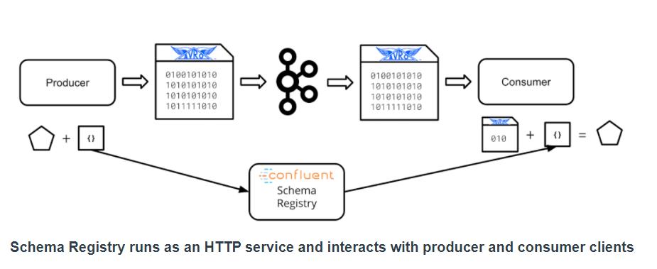

_Notes on Kafka Lesson 3 | August 2020_ 

# Data Schemas and Apache Avro

# Glossary

 - **Data Schema** - Define the shape of a particular kind of data. Specifically, data schemas define the expected fields, their names, and value types for those fields. Data schemas may also indicate whether fields are required or optional.
- **Apache Avro** - A data serialization framework which includes facilities for defining and communicating data schemas. Avro is widely used in the Kafka ecosystem and data engineering generally.
- **Record (Avro)** - A single encoded record in the defined Avro format
- **Primitive Type (Avro)** - In Avro, a primitive type is a type which requires no additional specification - null, boolean, int, long, float, double, bytes, string.
- **Complex Type (Avro)** - In Avro, a complex type models data structures which may involve nesting or other advanced functionality: records, enums, maps, arrays, unions, fixed.
- **Schema Evolution** - The process of modifying an existing schema with new, deleted, or modified fields.
- **Schema Compatibility** - Determines whether or not two given versions of a schema are usable by a given client
- **Backward Compatibility** - means that consumer code developed against the most recent version of an Avro Schema can use data using the prior version of a schema without modification.
- **Forward Compatibility** - means that consumer code developed against the previous version of an Avro Schema can consume data using the newest version of a schema without modification.
- **Full Compatibility** - means that consumers developed against the latest schema can consume data using the previous schema, and that consumers developed against the previous schema can consume data from the latest schema as well. In other words, full compatibility means that a schema change is both forward and backward compatible.
- **None Compatibility** - disables compatibility checking by Schema Registry.

---

<p align="center"></p>

## Data Schemas

Schemas help define the shape of the data, the fields in the data, the expected type of values, and whether fields are optional. 

Data schemas **provide expectations for applications** so they can properly ingest or produce data that match the specification. 

Data schemas are used for communication between software.

Avro is widely used in Hadoop.

gRPC is used in Kubernetes.

Data streams are constantly evolving and schemas allow consumers to function without updates. 

Schemas allow data **producers and consumers to develop independently**.

Schemas provide independence and scalability. And communicate version compatibility.

## Apache Avro

Apache Avro is a widely used data schema system in the data engineering space. 

Avro is a **data serialization system that uses binary compression**.

Avro sends the data along with the schema to instruct downstream application on how to decompress the data.

### Defining Avro Schemas

Avro schemas/records are defined in JSON.

All Avro schemas have a `type` and `name`. `namespace` is an optional field.

Example:
```
{
  “type”: “record”,
  “name”: “stock.price_change”,
  “namespace”: “com.udacity”,
  “fields”: [
      {“name”: “ticker”, “type”: “string”},
      {“name”: “prev_price”, “type”: “int”},
      {“name”: “price”, “type”: “int”},
      {“name”: “cause”, “type”: [“null”, “string”]}
  ]
}
```

Avro schemas are required to define an array of fields `"fields": [{"name": "age", "type": "int"}]`.

Avro can make a field optional by specifying the field type as null or some other type:
`"fields": [{"name": "age", "type": [“null”, "int"]}]`

### Avro Data types

Primitive type: null, int, boolean, string, float, long, bytes

Complex Types: record, enum, array, map, union, fixed.

Enums are good choince if there are limited numbers to define

Arrays store ordered fields of primitive or complex types.

Maps store fields as a string key to a value of primitive or complex type. 

Unions denote that more than one type may be used. E.g. null and int.

Fixed denotes a fixed size entry in bytes. Not used much.

See Lesson 3 Ch 13 on how to define complex types.

### Apache Avro and Kafka

Avro is used extensively in Kafka and using it will drastically improve user experience.

The ecosystem in Kafka supports Avro as it is incorporated early in the development process.

The Producer must define an Avro schema and encode the data. 

### Confluent Schema Registry

<p align="center"></p>

Confluent Schema Registry is an open-source tool that provides centralized Avro Schema storage. 

Sending schema with every message requires a lot of network overhead. It is better to store it in a central registry.

In Kafka the registry is set up as HTTP service. Has HTTP REST interface. 

Schema only need to be sent to Schema Registry once.

Historical schema can be pulled as well. Clients fetch schemas as needed from registry. 

Kafka Python has native support for Schema Registry.

## Schema Evolution

The process of schema change is referred to as **schema evolution**.
- examples are removing a field, making a field optional, or changing its type

When we update a schema in schema registry, we also send a compatibility setting. This tells client if new schema is compatible with current data. 

Schema Registry can track schema compatibility between schemas.
- both producer and consumer code need to manage compatibility by informing Schema Registry
- Consumers may opt to use the compatibility information to refuse to process data incompatible with its current configuration.

4 types of compatibility:
- backward
- forward
- full
- none

#### Backward Compatibility

It means consumers developed against the **latest schema** can use **data with older schema**.
- deletion of a field or addition of an optional field are backward compatible changes
- Update consumers before updating producers to ensure consumers can handle new data type

The `BACKWARD` compatibility type indicates compatibility with data from previous version but not any version before that. Schema Registry always assumes that changes are `BACKWARD` compatible.

The `BACKWARD_TRANSITIVE` compatibility type indicates compatibility with data from all prior versions of the schema.

#### Forward Compatibility

It means consumer code developed against the previous schema can use the latest data.
- Addition of new fields or deletion of optional fields are forward compatible changes.
- Producers need to be updated before consumers

The `FORWARD` compatibility indicates data produced with the latest schema is usable by consumers with the previous schema version.

The `FORWARD TRANSITIVE` compatibility indicates new data can be read by consumers with any of the previous schemas.

#### Full Compatibility

Consumers developed using the previous schema can use the latest data. Likewise, consumers using the latest schem can use the previous version data. The Schema change is both forward and back compatible.
- changing the default value on a field is fully compatible.
- can update producer or consumer first.

The `FULL` compatibility indicates the changed data is compatible with both current and previous schema.

`FULL TRANSITIVE` means that new data is compatible with current and all previous schema.

#### No Compatibility

`None` compatibility disables compatibility tracking by Schema Registry (NOT GOOD)
- E.g. changing data type of a field from int to float.
- use of `None` is not recommended. Does not utilize the value of Schema Registry.

Best Practice is to **create a new topic with the new schema** and update consumers to use that new topic. 

### Resources

- [Python fastavro Library](https://fastavro.readthedocs.io/en/latest/index.html)
- [Apache Avro specification](https://avro.apache.org/docs/1.8.2/spec.html)
- [Why Kafka prefers Avro](https://www.confluent.io/blog/avro-kafka-data/)