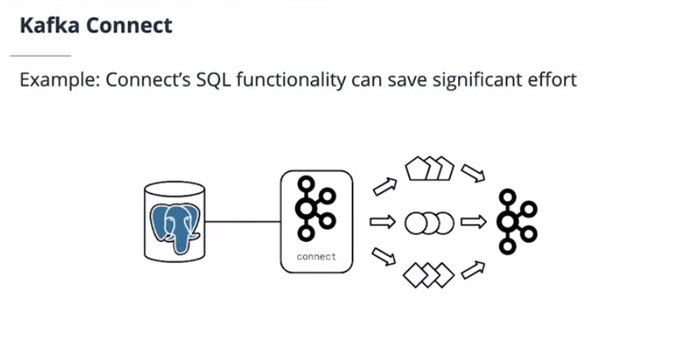
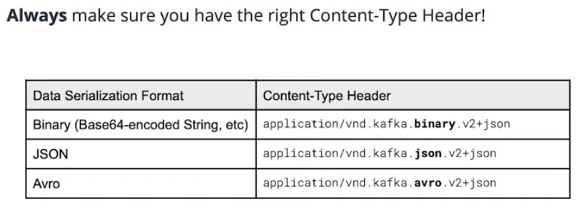

_Notes on Kafka Lesson 4 | August 2020_ 

# Kafka Connect and REST proxy

# Glossary

- **Kafka Connect** - A web server and framework for integrating Kafka with external data sources such as SQL databases, log files, and HTTP endpoints.
- **JAR** - Java ARchive. Used to distribute Java code reusably in a library format under a single file.
- **Connector** - A JAR built on the Kafka Connect framework which integrates to an external system to either source or sink data from Kafka
- **Source** - A Kafka client putting data into Kafka from an external location, such as a data store
- **Sink** - A Kafka client removing data from Kafka into an external location, such as a data store
- **JDBC** - Java Database Connectivity. A Java programming abstraction over SQL database interactions.
- **Task** - Responsible for actually interacting with and moving data within a Kafka connector. One or more tasks make up a connector.
- **Kafka REST Proxy** - A web server providing APIs for producing and consuming from Kafka, as well as fetching cluster metadata.

---

<p align="center"></p>

## Kafka Connect

Kafka Connect is a web server and framework written in Java and Scala for integrating Kafka with external data sources such as SQL databases, log files, and HTTP endpoints.

Kafka Connect can be used to handle common and repeated scenarios. 

Why Kafka Connect rather than Kafka client library:
- saves time
- less code to maintain
- allows abstraction to repeatedly implement similar Kafka integrations

Kafka connect uses Kafka to store its configuration and framework JARs to provide functionality.

We can write Kafka Connect Plug-in in Java to connect Kafka to an external source.

Components of Kafka Connect:
- Connectors: abstractions for managing task
- Tasks: contain producer or consumer code
- Converters: map data formats to and from Connect

### Kafka Connect Connectors

There are many open-source Connector plug-ins. 

Types:
- Local file source/sink: useful for logs
- Cloud key value store source/sink
- JDBC source/sink
- HDFS source/sink

[Kafka Connect plug-in search](https://www.confluent.io/hub/)

### Kafka Connect API

Kafka Connect is managed through a HTTP REST API. It's like making HTTP calls. 

We can create, update, delete, read (CRUD) on a specific Connectors task via the API.

We can start, stop, restart Connectors using the API.

API aids in monitoring Connectors. 

To check what connector plugins are in Kafka, run this in command line:
```
curl http://localhost:8083/connector-plugins | python -m json.tool
```

To pause connector:
`curl -X PUT http://localhost:8083/connectors/connector-name/pause`

To restart connector:
`curl -X POST http://localhost:8083/connectors/connector-name/restart`

To delete connector:
`curl -X DELETE http://localhost:8083/connectors/connector-name`

### Common Key Connectors

One of the most common usecases is routing of log data from microservices:

**FileStream Source connector** sends logs as events to Kafka.

Kafka Connect ships the log for us. The connector does not alter the underlying logging mechanism. 

**JDBC (Java DataBase Connector) for Sinks and Sources**
- puts data from a DB into Kafka
- takes data out of Kafka into a DB
- for connecting to SQL databases

Lesson 4 Ch 14 shows how to connect to a SQL database using JDBC!

## Kafka REST Proxy

There are times existing systems can't use client library or Kafka Connect. We need to use REST Proxy to send and receive data. 

REST Proxy is written in Java and Scala, runs on JVM.

REST Proxy may run as a webserver. Allows publish/consumptuon to Kafka over HTTP REST.

Cannot create topics. May only GET topic metadata. 

Only useful when Kafka clients library are not usable.

### Getting Kafka metadata using REST Proxy

**Useful for fetching metadata from our cluster.**

Lesson 4 Chapter 19 shows how to use HTTP REST Proxy to pull metadata about Kafka topic and brokers. 

### Using REST Proy to produce data

POST data to Kafka REST Proxy to produce data

<p align="center"></p>

We have to include Avro schema. 

Alwaus make sure to include the right Content-Type Header! 

<p align="center"></p>


### Resources

- [Python fastavro Library](https://fastavro.readthedocs.io/en/latest/index.html)
- [Apache Avro specification](https://avro.apache.org/docs/1.8.2/spec.html)
- [Why Kafka prefers Avro](https://www.confluent.io/blog/avro-kafka-data/)