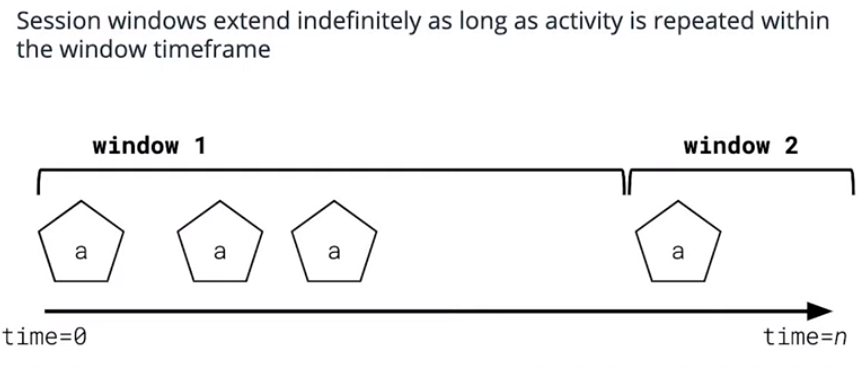

_Notes on Kafka Lesson 7 | August 2020_ 

# KSQL

# Glossary

- **Kafka Streams** - A Java library for constructing stream processing applications. KSQL translates SQL statements to Kafka Streams applications.
- **User Defined Function (UDF)** - An extension to the SQL capabilities of KSQL written by the user. For KSQL, these are written in Java.
- **Key (KSQL)** - Data which uniquely identifies the value contained in this data message relative to other pieces of data in the stream. For example, a user_id may uniquely identify a user object.
- **Session Windowing (KSQL)** - A system that keeps track of when the last time a particular key was seen. When a new record with the same key arrives, the difference between the timestamps is calculated. If the difference is larger than a defined session window, then a new window is started for that session. If the difference is less than the defined session window, the new record is added to the existing window.

---

## Intro to KSQL

SQL provides a SQL-like interface to transform Kafka Topics into streams and tables.

Behind the scene, the command is translated to Kafka Stream applications in Java.

Joins, aggregates, filtering, and other forms of data manipulation can then be expressed.

## KSQL Architecture

KSQL is built on Java and Scala, runs on JVM. 

Open-sourced in 2018 by Confluent. 

KSQL is built on Java Kafka Streams Library.

Kafka as Changelog, RocksDB for local storage.

A few options for interacting: REST API, CLI (Command Line tool), and File-based querying. 

## Pros and Cons of KSQL

Benefits
- Faster to write SQL queries
- Great fit for exploration when exact solution is not known
- No need for specific programming language skills
- Comes with logging and metrics out of box

Downside:
- not always easy to use SQL to solve all problems. 
- Can't import whatever library we want to use.
- User defined function has to be defined in Java

## Creating stream in KSQL

Creating a stream from a Kafka topic or from a query

``` 
    CREATE STREAM purchases (
        username VARCHAR,
        currency VARCHAR,
        amount INT
    ) WITH (
        KAFKA_TOPIC="purchases",
        VALUE_FORMAT="JSON"
    )
```

```
    CREATE STREAM purchases_high_value AS
        SELECT *
        FROM purchases
        WHERE amount > 100000;

```

To show topics in KSQL: `SHOW TOPICS;`

To show streams: `SHOW STREAMS;`

To show running queries: `SHOW QUERIES;`

To delete stream: 
```
TERMINATE query_of_interest
DROP STREAM stream_of_interest;
```

### Creating a table

```
CREATE TABLE users (
    username VARCHAR,
    address VARCHAR
) WITH (
    KAFKA_TOPIC = 'purchases',
    VALUE_FORMAT = 'JSON',
    KEY = 'username')  ;
```

Key has to be string!

Alternatively create table using select:
```
CREATE TABLE purchases_high_value AS
    SELECT * 
    FROM purchases
    WHERE amount > 1000;
```

IF we want KSQL to start from the **earliest offset** (want all data to be available), 

`SET 'auto.offset.reset' = 'earliest';`

To change it back:

`UNSET 'auto.offset.reset;`

To show tables: ` SHOW TABLES;`

Describe command show what the table is: `DESCRIBE table_of_interest;`

To delete a table, first show running queries, terminate query of interest, then drop table. 

### Querying 

`SELECT` statements may be run in KSQL CLI, but as soon as the session is terminated, the data will be wiped out.

Use `CREATE STREAM <stream_name> AS SELECT..` or `CREATE TABLE <table_name> AS SELECT ...` to persist your queries for long-term usage. 

`SUBSTRING` function takes a string and which character to start at (and optionally end at).
`UCASE` takes a string and capitalizes it.

### Windowing in KSQL

KSQL supports both tumbling and hopping.

Similar to Faust, we have to define size and step duration:

`WINDOW TUMBLING (SIZE 10 MINUTES)` 

`WINDOW HOPPING (SIZE 10 MINUTES, ADVANCE BY 10 SECONDS)` 

#### Session Windowing

Session windowing is available in KSQL but not in Faust:
<p align="center"></p>

- keeps track of differences between the time a key was last seen and the current key arrival time
- If the difference between time a key was last seen and current key arrival time, for two records with the same key, is larger than the session window length defined, a new window is started.
- If the difference between the time a key was last seen and the current key arrival time, for two records with the same key, is less than the session window length, the record is added to the current window, and the session expiration time is started anew. Full session period begins again.

`WINDOW SESSION (30 MINUTES)`

Useful for understanding user activity on website. 

### Aggregating Data 

KSQL supports aggregations like COUNT, MAX, MIN, SUM, TOPK, HISTOGRAM and more

`GROUP BY` allows re-partitioning of a stream or a table on a new key.

`HISTOGRAM` keeps track of how many times an event occurs.

`TOPK` shows the top x amount over the window.

``` 
SELECT currency, TOPK(amount, 10) -- show top 10 amounts
FROM purchase
WINDOW TUMBLING (SIZE 1 HOURS)
GROUP BY currency;
```

### Join in KSQL

Joining two streams to produce another stream:

```
SELECT p.username, p.amount, u.email
FROM purchase
JOIN users u ON p.username = u.username
```
Both streams must have the same key.

If they do not have the same key, we need to re-partition one or both dataset using `GROUP BY` operation.

We can join Streams to streams (can be windowed), streams to tables (not supported for windowing), tables to tables. **But cannot join tables to streams.**

**Cannot perform full outer join on streams to tables. Can only perform left or inner join.** tables may have too much information

Default join is `LEFT OUTER JOIN`. KSQL can also do `INNER JOIN` or `FULL OUTER JOIN`. FULL OUTER JOIN is only supported on streams to streams or tables to tables.


### Resources

- [KSQL documentation](https://docs.ksqldb.io/en/latest/developer-guide/syntax-reference/)
